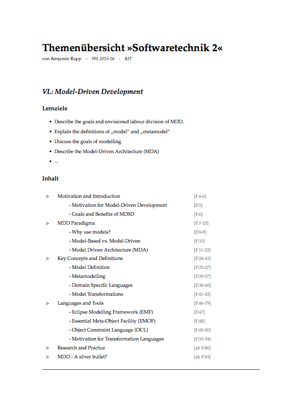

# TopicOverview
LaTex template to summarize the topics of a course at university.

## How to use the template

### General document information
To add the general document information use the following code:

	\documentclass[a4paper]{article}

	% Set document information.
	\newcommand{\workingDate}{\textsc{Feb 2016}}
	\newcommand{\docAuthors}{Benjamin Rupp}
	\newcommand{\institution}{KIT}
	\newcommand{\docCourseName}{Softwaretechnik 2}
	\newcommand{\docTerm}{WS 2015-16}

	\usepackage{topic-overview}

Then you can add the document title by adding these lines:

	\title{\docTitle}
	\author{\docAuthors}
	\date{\docTerm}

	\begin{document}

	\maketitle
	
After that you can add the *lesson* environments as described in the following section.

### Add document content
The template provides a *lesson* environment to group the topics of a specific lesson of this course. To structure the topics you can use the *topic* and *subtopic* commands. The following will give you a simple example of the usage:

	\begin{lesson}{Model-Driven Development}
	
		\topic{Motivation and Introduction}{[F.4-6]}
			\subtopic{Motivation for Model-Driven Development}{[F.5]}
			\subtopic{Goals and Benefits of MDSD}{[F.6]}
		\topic{MDD Paradigma}{[F.7-23]}
			\subtopic{Why use models?}{[F.8-9]}
			\subtopic{Model-Based vs. Model-Driven}{[F.10]}
			\subtopic{Model Driven Architecture (MDA)}{[F.11-23]}
		\topic{Key Concepts and Definitions}{[F.24-43]}
			\subtopic{Model Definition}{[F.25-27]}
			\subtopic{Metamodelling}{[F.29-37]}
			\subtopic{Domain Specific Languages}{[F.38-40]}
			\subtopic{Model Transformations}{[F.41-43]}
		\topic{Languages and Tools}{[F.46-79]}
			\subtopic{Eclipse Modelling Framework (EMF)}{[F.47]}
			\subtopic{Essential Meta-Object Facility (EMOF)}{[F.48]}
			\subtopic{Object Constraint Language (OCL)}{[F.49-50]}
			\subtopic{Motivation for Transformation Languages}{[F.53-54]}
		\topic{Research and Practice}{[ab F.80]}
		\topic{MDD - A silver bullet?}{[ab F.83]}

	\end{lesson}

Each *topic* and *subtopic* command offers the possibility to add a **name** as first parameter and the regarding **pages** in the script or slide set as second parameter.

A optional comment can be added by using the option field of a *topic* or *subtopic* command:

	\subtopic[Further information: \url{https://en.wikipedia.org/wiki/Metamodeling}]{Metamodelling}{[F.29-37]}

You can also add some *learning goals* of a lesson by using the option field:

	\begin{lesson}[
		\item Describe the goals and envisioned labour division of MDD.
		\item Explain the definitions of "`model"' and "`metamodel"'
		\item Discuss the goals of modelling
		\item Describe the Model-Driven Architecture (MDA)
		\item ...
	]{Model-Driven Development}

		...

	\end{lesson}

## Example output
The following image shows an example document which was created with the TopicOverview template.

## Development status
I created this template to summarize the content of my master courses at KIT. It's the first LaTex template I've created and I am sure that it could be realised in a much better way. But for me it works and I want to share this template in the hope that it will help somebody.

So, if you have some improvement proposals don't hesitate to contact me. By the way, this is my first Github project, too. ;-)